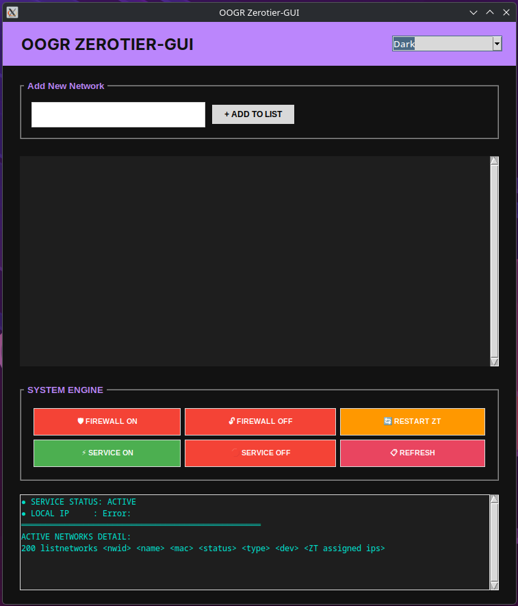
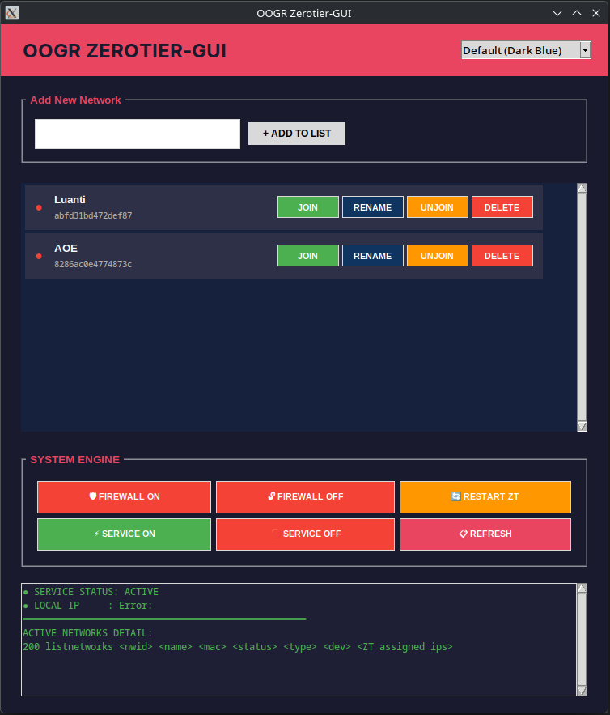

# OOGR ZeroTier-GUI
OOGR ZeroTier-GUI is a Python-based graphical user interface (GUI) using Tkinter to manage ZeroTier connections on Linux with style and ease.



## ✨ Key Features
- **Multi-Theme System**: Choose your favorite theme (Default, Dark, Light, Pinky, Zombie Green) instantly via the dropdown menu.
- **Smart Join/Unjoin**: Dedicated buttons to join or leave ZeroTier networks easily.
- **Dynamic Status Indicator**: A status dot that turns **Green** when connected and **Red** when disconnected.
- **System Engine Control**: One-click Firewall (UFW) management, ZeroTier service toggle, and service restart.
- **Network Registry**: Save your Network IDs with custom aliases for quick identification.
- **Live Console**: Monitor detailed output from `zerotier-cli` in real-time through the built-in console.

## 🛠️ Prerequisites
Ensure your system has the following installed:
- Python 3 (Tkinter)
- ZeroTier One (`zerotier-cli`)
- UFW (Firewall)
- `policykit-1` (required for `pkexec` to handle sudo commands)
---
### Debian
```bash
$ sudo apt update && sudo apt install python3-tk ufw zerotier-one -y
```
### Fedora
```bash
$ sudo dnf install python3-tkinter ufw zerotier-one -y
```
### Arch
```bash
$ sudo pacman -Syu tk ufw zerotier-one
```
### Void
```bash
$ sudo xbps-install -S python3-tkinter ufw zerotier-one
```
### Alpine
```bash
$ sudo apk add py3-tkinter ufw zerotier-one ttf-dejavu
```
---

## 🚀 How to Use
1. Clone this repository:
   ```bash
   $ git clone https://github.com/DidiSlothStanca/oogr-zerotier-gui.git
   ```
2. Extract to home
   ```bash
   $ tar -xf oogr-zerotier-gui.tar.gz ~/.
   ```
3. Open folder using terminal
   ```bash
   $ cd ~/oogr-zerotier-gui/
   ```
4. Launch Zerotier-GUI (make sure using sudo)
   ```bash
   $ sudo ./launch.sh
   ```
5. Done! you can manage Zerotier-CLI using GUI Mode
---

## 🎨 Theme Preview

The application supports a dynamic theme system selectable from the top-right corner:
1. Default: Elegant Dark Blue and Purple hues.
2. Dark: Classic dark mode for eye comfort.
3. Light: Clean and bright professional look.
4. Pinky: A bold Pink and Purple aesthetic.
5. Zombie Green: A unique neon green "Zombified" skeme.

## 📝 Security Note

This application will request password authentication (via pkexec) when performing system changes such as Joining, Leaving, or toggling the Firewall to ensure your system remains secure. 

---
## Developed with ❤️ by OOGR (Opensource OS Gaming Republic)
